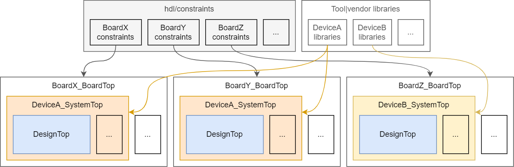

  <!--
  -->
  <!--
  -->
  <!--
  -->
  <!--
  -->

# FPGA board constraints

  

This repository provides constraint definitions in a standardised and distributed format, for decoupling board details
from design sources.
