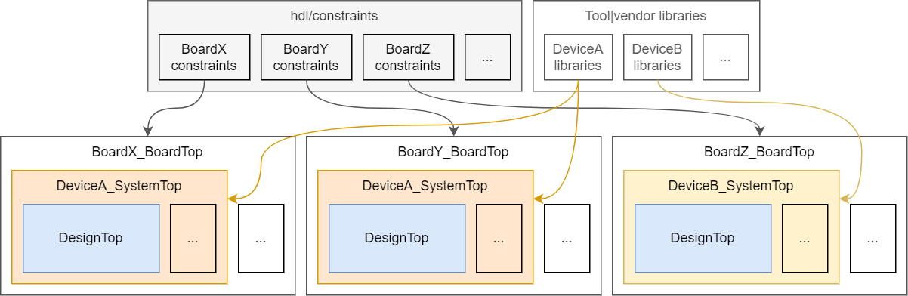

.. _Usage:

Usage
#####

This repository is expected to be added as a git submodule or otherwise vendored in existing HDL designs.
Then, data and/or constraints files can be used straightaway, or through the helper Python scripts.

   Example of the HDL source structure to use one design on three different FPGA boards, two of them having the same
   FPGA device.

As shown in the Figure, it is recommended to organise HDL sources in one or two levels of abstraction around the
top-level unit of the logic design:

* **DesignTop**: the code which is mostly unmodified regardless of the task (simulation or implementation), the
  tool, or the board/device.
* **SystemTop**: description of device specific resources, such as PLLs, DCMs, RAM controllers, etc.
* **BoardTop**: description of board specific resources and type/polarity conversions:

  * Normalize low-active signals to high-active signals.
  * I/O buffers, if needed.
  * Input synchronization.
  * Output flip-flops.
  * Converting a tristate-bus (I, O, T) to a bi-directional inout signal (and bi-directional buffer).
  * Debouncing and maybe edge-detection.

.. TIP::
  In less complex designs, ``SystemTop`` and ``BoardTop`` sources are typically merged in a single one.

.. HINT::
  Find examples in the following repositories:

    * :ghrepo:`stnolting/neorv32-setups`
    * :ghrepo:`PLC2/Solution-StopWatch`
    * :ghrepo:`dbhi/vboard`
